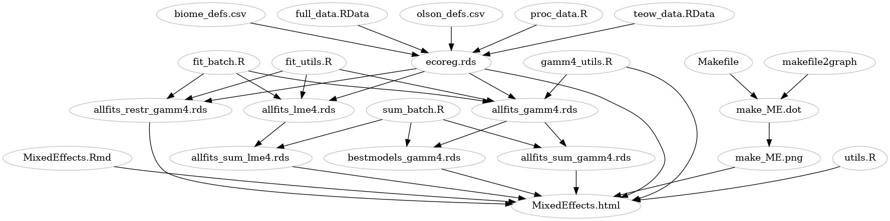

This is an attempt at a streamlined and yet complete, relatively *a priori*/non-
snooped model analysis. **Note** that this version is an overhaul, with some missing components from the older results: see `MixedEffects_older.Rmd` ...

Some parts of the analysis have been moved into separate `.R` files: the overall workflow is



```{r get_utils}
source("utils.R")
source("gamm4_utils.R")
```

Packages used/versions:
```{r load_packages,message=FALSE}
load_all_pkgs()
library('pander')  ## for tables
sapply(pkgList,function(x) format(packageVersion(x)))
comb_out <- function(p,fn,...) {
    print(p)
    htmlwidgets::saveWidget(ggplotly(p,...),fn)
}
```

```{r graph_setup}
graphics_setup()
```

```{r knitr_setup,echo=FALSE}
library(knitr)
opts_chunk$set(error=FALSE,dev.args = list(png = list(type = "cairo")))
```

Data from Enric (includes area and lat/long coordinates):
```{r get_data}}
ecoreg <- readRDS("ecoreg.rds")
```

Limit all observations with all predictor variables > 0 and no biome 98/99; set `biome` as factor. Log and scale/center variables as appropriate. This leaves us with `r ncol(ecoreg)` variables and
`r nrow(ecoreg)` observations.

## Model fitting

This can now be done semi-automatically (i.e., fit all combinations
of random effects) by using the function `fit_all` from the `utils.R`
file (sourced above), e.g. `fit_all(response="mbirds_log")`

The `fit_batch.R` code has already run all
random-effects model combinations for all four response variables,
both with `lme4` and with `gamm4`.  `sum_batch.R` reduces
these to lists with components `sum` (summaries: AIC, singularity, etc.);
`coef` (coefficients); and `pred` (fitted, residuals, etc.).

Load data: summaries containing

- `coefs`: coefficients for all models
- `sum`: summaries for all models: `taxon`, `model`, `AIC`, `singular` (singular fit or not?), `df` (number of parameters), `best` is this the "best" (min-AIC non-singular fit for each taxon) model?
- `pred`: predictions for all models

```{r load_data}
lme4_res <- readRDS("allfits_sum_lme4.rds")  ## 4 taxa x 27 fits, using lmer
gamm4_res <- readRDS("allfits_sum_gamm4.rds") ## 4 taxa x 27 fits, using gamm4
```

Table of models with AIC<10:

```{r aic1, results="asis"}
aictab1 <- lme4_res$sum %>%
    filter(AIC<8) %>%
    arrange(taxon,AIC) %>%
    mutate(AIC=round(AIC,1),
           model=shorten_modelname(model))
pander(dplyr::select(aictab1,-best),emphasize.strong.rows=which(aictab1$best))
```


Best (non-singular) models only:

```{r get_best, results="asis"}
get_best <- . %>% .[["sum"]] %>% filter(best) %>% dplyr::select(-c(best,singular))
all_best_sum <- purrr::map_dfr(list(lme4=lme4_res,gamm4=gamm4_res), get_best, .id="type")
pander(all_best_sum)
```

Our current strategy is to (1) take the best non-singular model
fitted by `lme4`; (2) find the coefficients of the corresponding `gamm4` model.
(Below, we also try taking the best non-singular `gamm4` model.)

```{r best_models}
get_best_tm <- . %>% get_best() %>% dplyr::select(taxon, model)
lme4_best_models <- lme4_res %>% get_best_tm()
gamm4_best_models <- gamm4_res %>% get_best_tm()
## keep only predictions from best models
gamm4_best_pred <- gamm4_res$pred %>%
    right_join(lme4_best_models,by=c("taxon","model"))
```

Fitted vs residual for all four taxa:
```{r fr,message=FALSE,warning=FALSE,fig.width=8,fig.height=4}
ggplot(gamm4_best_pred,aes(.fitted,.resid))+
    geom_point()+geom_smooth()+
    facet_wrap(~taxon,nrow=1)+zmargin
```

A little bit heavy-tailed ...
```{r qq,message=FALSE,warning=FALSE,fig.width=8,fig.height=4}
## https://stackoverflow.com/questions/40598011/how-to-customize-hover-information-in-ggplotly-object
ggqq <- ggplot(gamm4_best_pred,aes(sample=.resid,
                                   colour=biome,
                                   flor_realms=flor_realms))+
    stat_qq()+stat_qq_line(aes(group=taxon))+
    facet_wrap(~taxon,nrow=1)+zmargin
comb_out(ggqq,"ggqq.html",tooltip=c("biome","flor_realms"))
```

([dynamic alternative](./ggqq.html))

## coefficient plot of all models tried

For example (was using plants, now birds because we might not be fitting the models for plants):

```{r all_coefplot}
ex <- "mbirds_log"
gamm4_allcoef <- get_allcoefs(gamm4_res,focal_taxon=ex) %>% add_wald_ci()
lme4_allcoef <- get_allcoefs(lme4_res,focal_taxon=ex) %>% add_wald_ci()
gg_allcoef <- ggplot(gamm4_allcoef,aes(estimate,model,colour=singular,shape=singular))+
    ## use point + linerange because some RE are missing std.errors
    geom_point()+
    geom_linerangeh(aes(xmin=lwr,xmax=upr))+
    facet_wrap(~term,scale="free_x")+
    geom_vline(xintercept=0,lty=2)+
    scale_colour_brewer(palette="Set1")+
    zmargin
```

All `gamm4` coefs for `r ex`:
```{r gamm4_allcoefs_ex,fig.width=10,fig.height=8}
print(gg_allcoef)
```

all `lme4` coefs for `r ex`
```{r lme4_allcoefs_ex,fig.width=10,fig.height=8}
print(gg_allcoef %+% lme4_allcoef)
```

**to do**: why so many singular now ... ?

**to do**: redo profiling/profile plots,
comparison of Wald/profile CIs (at least for best models ...

Check difference between Wald and likelihood profile
confidence intervals.
In principle profile CIs are more accurate - **if** the computations
have run reliably ... but I would probably be conservative and take
the wider of the two.

Pull out coefs from best models for `lme4`, `gamm4` (from `lme4`-best model),
`gamm4` (from `gamm4`-best model)
```{r best_model_coefs}
## lmer-best fits fitted via gamm4
gamm4_best_coef <- gamm4_res$coef %>%
    right_join(lme4_best_models,by=c("taxon","model")) %>%
    add_wald_ci %>% drop_intercept
## gamm4-best fits
gamm4_best2_coef <- gamm4_res$coef %>%
    right_join(gamm4_best_models,by=c("taxon","model")) %>%
    add_wald_ci %>% drop_intercept
## lmer-best fits
lme4_best_coef <- lme4_res$coef %>%
    right_join(lme4_best_models,by=c("taxon","model")) %>%
    add_wald_ci %>% drop_intercept
all_best_coef <- bind_rows(list(lme4=lme4_best_coef,gamm4=gamm4_best_coef,
                                gamm4_2=gamm4_best2_coef),
                           .id="type")
```

**to do**: plot all coefficients including std devs (need to combine group with term for random effects)

Exclude random effects and `NPP_log_sc` (which is large and
significant for all taxa). **Abuse warning**: coloring significant effects.
**Snooping warning**: counting number of sig values for each model type!

```{r coeftab2,message=FALSE,echo=FALSE}
ctx <- all_best_coef %>%
    filter(effect=="fixed" & term!="NPP_log_sc") %>%
    mutate(sig=factor((lwr*upr)>0),
           term=reorder(term,estimate))
pd <- position_dodgev(height=0.33)
ggplot(ctx,aes(estimate,term,group=interaction(term,type),colour=sig,shape=type))+
    geom_linerangeh(aes(xmin=lwr,xmax=upr),position=pd)+
    geom_point(position=pd,fill="white")+
    geom_vline(xintercept=0,lty=2)+
    facet_wrap(~taxon)+  ## ncol=1 might be nice, but too skinny
    labs(x="",y="")+
    scale_colour_manual(values=c("black","orange"),guide=FALSE)+
    scale_shape_manual(values=c(16,21,17))+
    zmargin
```

There are not a lot of effects other than `NPP_log_sc` that are consistently large
and significant; perhaps main effects of fire for birds and mammals.
Amphibians have considerably larger effects (the last three: Feat cv and its
interactions).

Enric and I decided that it was probably best to go with the gamm4-best models,
with some caution expressed about the effects that were marginal. Here are the final(ish?) results, with NPP effects added back in:

```{r coeftab2_gamm4only,message=FALSE,echo=FALSE}
ctx <- gamm4_best2_coef %>%
    filter(effect=="fixed") %>% 
    mutate(sig=factor((lwr*upr)>0),
           term=reorder(term,estimate))
ggplot(ctx,aes(estimate,term,colour=sig))+
    geom_linerangeh(aes(xmin=lwr,xmax=upr))+
    geom_point(position=pd,fill="white")+
    geom_vline(xintercept=0,lty=2)+
    facet_wrap(~taxon)+  ## ncol=1 might be nice, but too skinny
    labs(x="",y="")+
    scale_colour_manual(values=c("black","orange"),guide=FALSE)+
    zmargin
```


## Plotting functions

Load best non-singular gamm4 fits:

```{r load_bestmodels_gamm4}
best_models <- readRDS("bestmodels_gamm4.rds")
names(best_models)
```

`plotfun()` takes arguments:

- `model`: fitted model
- `xvar` ("NPP_log_sc"): x-variable
- `auxvar` ("Feat_cv_sv"): auxiliary variable (e.g. for examining interactions)
- `respvar` (equal to model response by default): response variable
- `aux_quantiles`: (0.1, 0.5, 0.9) quantiles of auxiliary variable to predict
- `pred_lower_lim` (-3) : lower cut off values (log scale)
- `data` (ecoreg)
- `re.form` (NA) which RE to include in *predictions* (default is none)

```{r predplot,fig.width=10,fig.height=8,warning=FALSE}
bm <- best_models[[ex]]
p1A <- plotfun(bm)+nolegend
p1B <- plotfun(bm,backtrans=TRUE)+nolegend
p1C <- plotfun(bm,backtrans=TRUE,log="xy")+nolegend
cowplot::plot_grid(p1A,p1B,p1C,labels="auto")
```

This plot shows (a) observed points and fit on log scale (using "fire eaten" as aux variable, i.e. lines show predictions for 0.1/0.5/0.9 quantiles of fire-eaten); (b) points and back-transformed predictions; (c) the same, but with a constrained scale; (d) back-transformed preds with scaled *axes* (`scale_*_log10()`) (scale also constrained)

Partial residuals:

```{r test_backtrans}
p1D <- plotfun(bm,respvar="partial_res")+nolegend
p1E <- plotfun(bm,respvar="partial_res",backtrans=TRUE)+nolegend
p1F <- plotfun(bm,respvar="partial_res",backtrans=TRUE,log="xy")+nolegend
partial_res_plot <- cowplot::plot_grid(p1D,p1E,p1F,labels="auto")
print(partial_res_plot)
```

## $R^2$ across taxa

Only a few effects have partial $R^2$ values of more than a few percent:
NPP (of course), fire (for mammals and ?birds?), and fire CV (for amphibians).
Everything else is going to be pretty subtle (provided of course that
we trust this particular way of estimating $R^2$).

```{r rsq_calc}
all_rsq <- purrr::map_dfr(best_models,
                   ~r2beta(.$mer),.id="taxon") %>%
    mutate(Effect=as.character(Effect),
           Effect=gsub("^X","",Effect),
           Effect=reorder(factor(Effect),Rsq))           
```

```{r rsq_plot}
rsqplot <- ggplot(all_rsq,aes(Rsq,Effect,colour=taxon,shape=taxon))+
    geom_pointrangeh(aes(xmin=lower.CL,xmax=upper.CL),
                   position=position_dodgev(height=0.5))+
    scale_colour_brewer(palette="Dark2")+
    ## scale_x_log10(limits=c(1e-2,1),oob=scales::squish)+
    labs(y="")
print(rsqplot)
```

Plot in two panels:

```{r rsqplot2}
all_rsq$upper <- with(all_rsq,Effect %in% c("Model","NPP_log_sc","log(area_km2)"))
r1 <- rsqplot %+% subset(all_rsq,upper)
r2 <- rsqplot %+% subset(all_rsq,!upper)
## facet_wrap doesn't have 'space' argument ...
## rsqplot %+% all_rsq +facet_wrap(~upper,ncol=1,scales="free")
## facet_grid doesn't use axes for all facets ...
## rsqplot %+% all_rsq +facet_grid(upper~.,scales="free",space="free") +
##    theme(strip.text=element_blank())
## https://cran.r-project.org/web/packages/cowplot/vignettes/shared_legends.html
L <- get_legend(r1)
## stack facets
p1 <- plot_grid(r1
                +labs(x="")
                ## rectangle indicating scale of lower box w/in upper
                + geom_rect(xmin=0,xmax=0.125,ymin=-Inf,ymax=Inf,
                            fill="black",
                            colour=NA,alpha=0.02)
                + theme(legend.position="none"),
                r2+theme(legend.position="none"),
                ncol=1,
                align="v",rel_heights=c(0.3,0.7),axis="b")
## add legend
plot_grid(p1,L,rel_widths=c(2,0.4))
```

What about a combined "fire $R^2$"? (**not working yet**)

```{r cmp_R2}
x <- best_models[[1]]
SigHat <- extract.merMod.cov(x$mer)
X <- getME(x$mer,"X")
beta <- fixef(x)
C <- matrix(0,nrow=1,ncol=length(beta))
C[grepl("Feat",names(beta))] <- 1
## doesn't work yet ...
## cmp_R2(c=C, x=X, SigHat=SigHat, beta=beta, method = 'nsj')
## what should obsperclust, nclusts, be for a crossed RE model??
```

## Models fitted with only biome and flor_realms

(from `fit_batch.R`): diagonal (independent) random effects
at the biome and flor realm level.
One of the keys here is that the line for each biome is estimated
based on the median values of the other predictors (fire, NPP CV,
area, etc.) for that *particular* biome, not the global median ...

```{r predfun_biome_construct}
allfits_restr_gamm4 <- readRDS("allfits_restr_gamm4.rds")
predList <- lapply(allfits_restr_gamm4,
       predfun,
       auxvar=NULL,grpvar="biome",
       re.form=~(1+NPP_log_sc|biome))
set.focal <- function(n,d) { d$focal <- d[[n]]; return(d) }
predList <- Map(set.focal,names(predList),predList)
predFrame <- bind_rows(predList,.id="taxon")
dList <- setNames(replicate(4,ecoreg,simplify=FALSE),names(predList))
dList <- Map(set.focal,names(dList),dList)
dFrame <- bind_rows(dList,.id="taxon")
```

```{r predfun_biome_plot,warning=FALSE,fig.width=10,fig.height=8}
ggplot(predFrame,aes(x=NPP_log_sc,y=focal,colour=biome))+
    geom_line(lwd=1.5)+
    geom_point(data=dFrame,aes(shape=flor_realms),alpha=0.7)+
    facet_wrap(~taxon)+zmargin+
    labs(y="log diversity")+
    theme(legend.position="bottom")
```

Version with `Feat_log_sc` (main effect of fire) as focal predictor:

```{r predList_fire}
predList_fire <- lapply(allfits_restr_gamm4,
       predfun,
       xvar="Feat_log_sc",
       auxvar=NULL,grpvar="biome",
       re.form=~(1+Feat_log_sc|biome))
predList_fire <- Map(set.focal,names(predList_fire),predList_fire)
predFrame_fire <- bind_rows(predList_fire,.id="taxon")
```

```{r predfun_biome_plot_fire,warning=FALSE,fig.width=10,fig.height=8}
(gpbf1 <- ggplot(predFrame_fire,aes(x=Feat_log_sc,y=focal,colour=biome))+
    geom_line(lwd=1.5)+
    geom_point(data=dFrame,aes(shape=flor_realms),alpha=0.7)+
    facet_wrap(~taxon)+zmargin+
    labs(y="log diversity")+
    theme(legend.position="bottom"))
```

```{r predfun_biome_plot_fire_ribbon,warning=FALSE,fig.width=10,fig.height=8}
gpbf1 + geom_ribbon(colour=NA,aes(ymin=lwr,ymax=upr,group=biome),alpha=0.2)
```

Plot random effects estimates
with $\pm$ 2 SE (these effects do *not* include the effects of
the variation of levels of NPP and fire across biomes/realms; they
represent deviations from the expectation based on the population-level
effects ...)

```{r coefplot_calcs, echo=FALSE}
tt_all_lst <- lapply(allfits_restr_gamm4,
                 function(x) (x$mer
                   %>% tidy(effects="ran_vals")
                   %>% dplyr::select(-effect)
                   %>% filter(group!="Xr", term !="(Intercept)",
                              group!="flor_realms")))
tt_all <- bind_rows(tt_all_lst,.id="taxon")
gg2A <- ggplot(tt_all,aes(x=estimate,y=level,colour=taxon))+
    geom_pointrangeh(aes(xmin=estimate-2*std.error,
                         xmax=estimate+2*std.error),
                     position=position_dodgev(height=0.25))+
    geom_vline(xintercept=0,lty=2,colour="red")+
    theme(panel.spacing.x=grid::unit(0,"lines"))
ggL <- lapply(unique(tt_all$term),
              function(x) {
                tt3 <- tt_all[tt_all$term==x,]
                tt3$level <- reorder(tt3$level,tt3$estimate)
                gg <- (gg2A %+% tt3)+ggtitle(x)+labs(y="")
                return(gg)
              })
```

```{r coefplot_plot,fig.width=8}
do.call(plot_grid,ggL)
ff <- filter(tt_all, taxon=="mbirds_log", group=="biome",term=="NPP_log_sc")
gg2A %+% ff
```

## Extract coefficients

In this particular case the effect of NPP only varies across floristic realms,
so the picture isn't especially pretty:

```{r coef_var}
coefs_plants <- merge_coefs(ecoreg,best_models[[1]])
ggplot(coefs_plants,aes(x,y,colour=NPP_log_sc))+
    geom_point()+
    scale_colour_viridis()
```

## No-fire predictions

```{r}
predList_fire <- lapply(best_models,
       predfun,
       auxvar=NULL,grpvar=NULL)
predList_nofire <- lapply(best_models,
       predfun,
       auxvar=NULL,grpvar=NULL,
       exclude_fire=TRUE)
```


## Methods description

For analysis, we log-transformed all response and predictor variables except the interannual coefficients of variation.

For ease of interpretation, we scaled and centered all predictor variables for ease of interpretation; this allows parameter estimates to be interpreted as relative effect sizes across predictors with different units, i.e. the expected change in the response (log-diversity) from an increase of 1 standard deviation in the predictor (CITE: Schielzeth 2010). The data were grouped at three levels: biome (e.g. tropical forest), realm (e.g. Neotropics), and their interaction (e.g. Neotropical forests).
	
As fixed-effect (overall, global-scale) predictors, we incorporated ecoregion area (km^2); annual NPP (G C/m^2/year); average fraction of NPP consumed by fire annually (proportion); and the interannual coefficient of variation of NPP and fire losses, as well as the pairwise interactions of all of these predictors except for area. In principle we would also like to allow all the effects of all of these predictors, and their interactions, to vary at all three grouping levels (biome, realm, biome $\times$ realm), and to estimate all of the correlations among them. For example, it would be interesting to know if biomes where diversity was more sensitive to NPP also had diversity that was more sensitive to fire, or realms where diversity was more sensitive to variation in fire were *less* sensitive to variation in NPP. However, the full model with correlated variation at all three levels is very complex; the covariance matrix for each level has 15 parameters (for the covariance matrix of an intercept plus four predictors, we have (5x6)/2=15 independent values in a 5x5 symmetric matrix). This leads to poorly estimated parameters, and often to singular fits where some variances are estimated as zero or correlations as $\pm 1$ (CITE Barr et al 2013, others?). We thus allowed for some simplified versions of the model, either assuming the variation across groups was uncorrelated (5 parameters in a diagonal covariance matrix vs. 15 in an unstructured matrix) or assuming that only the intercept varied across groups (1 parameter). For each taxon we fitted all 27 possible model combinations ((intercept-only, independent, full) $\times$ (biome, realm, biome $\times$ realm)), checked for singularity, and computed the AIC. We selected the non-singular model with the best (lowest) AIC.
